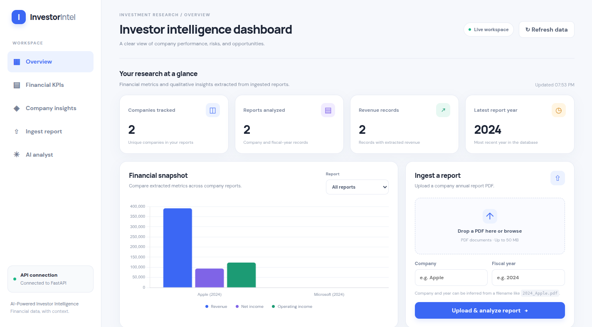
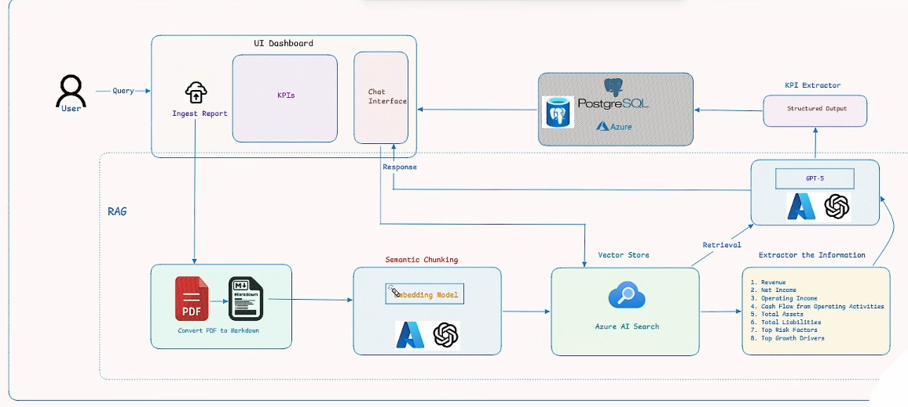
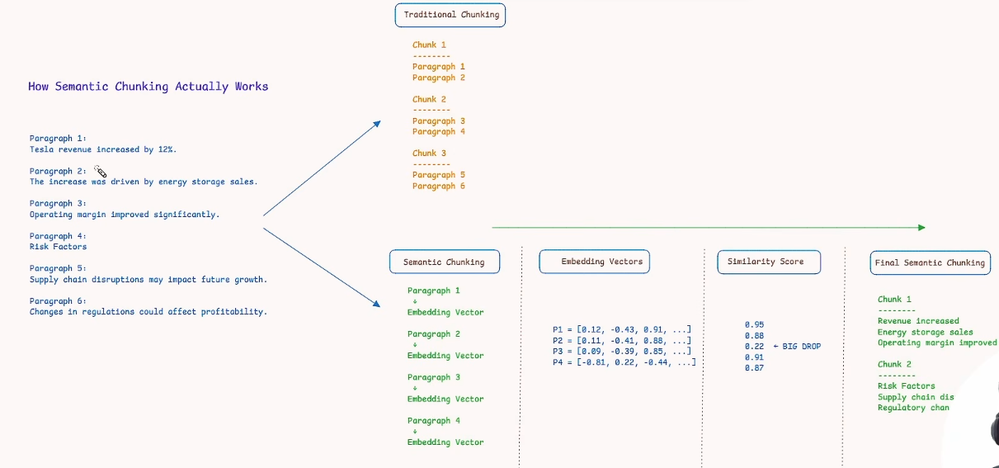
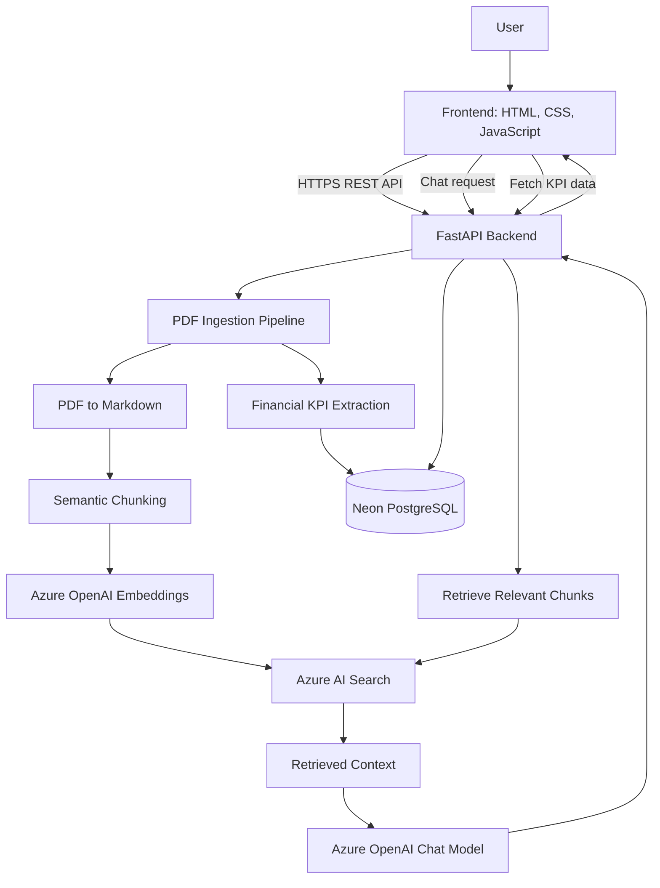

# AI-Powered Investor Intelligence Platform

An AI-powered financial research application that processes company annual reports, extracts key financial metrics, stores structured data, and enables users to ask natural-language questions about financial documents.


## Screenshots

### Dashboard


### System Architecture


### Semantic Chunking



**Live Demo:** [Open Investor Intelligence Platform](https://ai-powered-investor-platform-invest.vercel.app/)  
**API Documentation:** [Explore FastAPI Swagger UI](https://ai-powered-investor-platform.onrender.com/docs)

## Overview

Financial annual reports contain large amounts of structured and unstructured information. Extracting key metrics and finding relevant information manually can be time-consuming.

This project combines document processing, Retrieval-Augmented Generation (RAG), vector search, and relational data storage to make financial information easier to explore.

Users can upload annual-report PDFs, process them through the existing ingestion pipeline, view extracted financial metrics, and interact with the document through an AI-powered chat interface.

## Features

- **PDF ingestion:** Upload annual reports through the web interface.
- **Document processing:** Convert PDFs into Markdown and split content using semantic chunking.
- **Embeddings and vector search:** Generate document embeddings and index content in Azure AI Search.
- **Financial KPI extraction:** Extract metrics such as revenue, net income, operating income, cash flow, assets, and liabilities.
- **Persistent structured storage:** Store financial metrics in PostgreSQL.
- **Natural-language questions:** Ask questions about indexed financial documents using a RAG workflow.
- **Financial dashboard:** View stored metrics and compare financial figures across company reports.
- **REST API:** Access backend functionality through FastAPI endpoints.
- **Cloud deployment:** Run the frontend and backend as separately deployed services.

## Live Application

| Component | Deployment |
|---|---|
| Frontend | [Vercel](https://ai-powered-investor-platform-invest.vercel.app/) |
| Backend API | [Render](https://ai-powered-investor-platform.onrender.com/) |
| Interactive API documentation | [Swagger UI](https://ai-powered-investor-platform.onrender.com/docs) |
| Relational database | Neon PostgreSQL |
| Vector search and embeddings/chat services | Azure AI services |

## Architecture



### Main components

- **Frontend:** Plain HTML, CSS, and JavaScript.
- **Backend:** Python and FastAPI, with routes for ingestion, KPI retrieval, chat, and health checks.
- **Document processing:** PDF-to-Markdown conversion and semantic chunking.
- **LLM integration:** Azure OpenAI for embeddings and chat generation.
- **Vector database/search:** Azure AI Search for retrieving relevant document chunks.
- **Relational database:** Neon-hosted PostgreSQL for structured financial metrics.
- **Deployment:** Vercel for the static frontend and Render for the backend API.

## RAG and Ingestion Workflow

The document ingestion workflow connects the existing processing modules through the backend API.

1. The user uploads a company annual-report PDF.
2. The backend starts the ingestion workflow.
3. The PDF is converted into Markdown.
4. The Markdown content is split into semantically meaningful chunks.
5. The embedding model generates vector representations of the chunks.
6. The chunks and their vectors are indexed in Azure AI Search.
7. The KPI extraction workflow identifies financial metrics.
8. Extracted metrics are stored in PostgreSQL.
9. For a user question, the backend retrieves relevant document chunks and uses the retrieved context to generate an answer.

The vector index supports semantic retrieval, while PostgreSQL stores structured financial metrics for dashboard queries. These two storage systems serve different purposes.

## Technology Stack

| Area | Technologies |
|---|---|
| Language | Python, JavaScript |
| Backend | FastAPI, Uvicorn |
| Frontend | HTML, CSS, JavaScript |
| LLM and embeddings | Azure OpenAI |
| Vector search | Azure AI Search |
| Database | PostgreSQL, SQLAlchemy, Neon |
| Document processing | PyMuPDF4LLM, Markdown conversion, semantic chunking |
| API documentation | OpenAPI, Swagger UI |
| Hosting | Render, Vercel |
| Version control | Git, GitHub |

## API Endpoints

The API exposes the following main operations. Open the Swagger documentation for request schemas, parameters, and response formats.

| Method | Endpoint | Purpose |
|---|---|---|
| GET | `/health` | Basic service health check |
| GET | `/health/ready` | Check service readiness and dependencies |
| POST | `/api/ingest` | Start report ingestion |
| GET | `/api/ingest/{job_id}` | Check ingestion job status |
| GET | `/api/kpis` | Retrieve stored financial KPIs |
| GET | `/api/kpis/{company}/{year}` | Retrieve KPIs for a company and year |
| POST | `/api/chat` | Ask a question using the RAG workflow |

**Interactive documentation:** [Open Swagger UI](https://ai-powered-investor-platform.onrender.com/docs)

## Repository Structure

```text
.
├── api/
│   ├── routes/
│   │   ├── chat.py
│   │   ├── health.py
│   │   ├── ingest.py
│   │   └── kpis.py
│   └── schemas.py
├── database/
│   ├── create_table.py
│   ├── metrics.py
│   └── postgres_sql.py
├── ingestion/
│   ├── ingest_documents.py
│   ├── pdf_to_markdown.py
│   └── semantic_chunker.py
├── investor-intelligence-frontend/
│   ├── index.html
│   ├── app.js
│   └── style.css
├── llm/
├── rag/
├── services/
├── vectorstore/
├── app.py
├── requirements.txt
├── README.md
└── images/
```

## Running Locally

### Prerequisites

- Python 3.13
- Access to configured Azure AI services
- A PostgreSQL database
- Azure OpenAI and Azure AI Search credentials

### 1. Clone the repository

```bash
git clone https://github.com/Samyak05/AI-Powered-Investor-Platform.git
cd AI-Powered-Investor-Platform
```

### 2. Create and activate a virtual environment

```bash
python3.13 -m venv .venv
source .venv/bin/activate
```

### 3. Install dependencies

```bash
pip install -r requirements.txt
```

### 4. Configure environment variables

Create a local `.env` file using the variable names expected by the project configuration.

Configure the necessary values for:

- Azure OpenAI endpoint, API key, embedding deployment, chat deployment, and API versions.
- Azure AI Search endpoint, API key, and index name.
- PostgreSQL connection URL.
- Frontend CORS origins and application logging configuration.

Never commit `.env` files or API keys to GitHub. Use environment variables or a secrets manager for deployment.

### 5. Start the backend

```bash
uvicorn app:app --host 0.0.0.0 --port 8000
```

Open the API documentation at:

`http://localhost:8000/docs`

### 6. Start the frontend

In a separate terminal:

```bash
cd investor-intelligence-frontend
python -m http.server 5500
```

Open:

`http://localhost:5500`

For local development, configure the frontend API base URL and backend CORS settings for your local environment.

## Deployment

### Frontend — Vercel

The static frontend is deployed from the `investor-intelligence-frontend/` directory.

- Framework preset: Other
- Output directory: `.`
- No frontend build step is required for the current plain JavaScript application.
- The frontend API base URL points to the deployed Render backend.

### Backend — Render

The FastAPI backend is deployed as a Python web service.

**Build command**

```bash
pip install -r requirements.txt
```

**Start command**

```bash
uvicorn app:app --host 0.0.0.0 --port $PORT
```

The deployment uses Python 3.13. The backend reads its service credentials from Render environment variables. CORS is configured to allow requests from the deployed frontend origin.

### Database and AI services

- Neon provides the hosted PostgreSQL database.
- Azure AI Search stores and retrieves indexed document chunks.
- Azure OpenAI provides embedding and chat model deployments.

These services are configured independently from the frontend and backend hosting platforms.

## Free-Tier Considerations

The project was deployed using free-tier hosting options where available. Free-tier availability, quotas, and terms can change.

- **Render:** Free web services can sleep after inactivity, so the first request after a period of inactivity may be slower. Resource and execution limits apply.
- **Vercel:** Static frontend hosting is subject to the applicable plan's usage limits.
- **Neon:** Database storage, compute, and usage are subject to the selected plan's limits.
- **Azure AI services:** Model usage, embedding requests, search capacity, quotas, and billing depend on the Azure subscription, region, deployment, and service configuration.

Free hosting does not mean every component of the application is necessarily free. Monitor usage and billing for Azure AI services and other managed resources, and verify current plan limits before running large ingestion jobs.

## Engineering Challenges and Lessons

This deployment involved integrating several independently configured services:

- Connecting a cloud-hosted FastAPI backend to a managed PostgreSQL database.
- Configuring Azure AI Search and Azure OpenAI through environment variables.
- Resolving Python-version compatibility issues during cloud builds.
- Connecting a separately hosted frontend and backend.
- Debugging browser CORS errors and validating API responses through browser developer tools and service logs.
- Separating structured financial data storage from semantic document retrieval.

These experiences helped validate the application beyond local execution and provided practical experience with cloud configuration, API integration, deployment troubleshooting, and service observability.

## Demo Walkthrough

1. Open the [live dashboard](https://ai-powered-investor-platform-invest.vercel.app/).
2. Review the dashboard and stored financial KPIs.
3. Upload an annual-report PDF and provide the company name and fiscal year if required.
4. Wait for the ingestion pipeline to complete.
5. Review the extracted metrics.
6. Open the AI analyst and ask a question about the uploaded report.
7. Inspect the API routes and responses through [Swagger UI](https://ai-powered-investor-platform.onrender.com/docs).

## Future Improvements

- Add automated tests for ingestion, retrieval, and KPI extraction.
- Improve observability for long-running ingestion jobs and failures.
- Add stronger validation and clearer error reporting for uploaded documents.
- Add authentication, authorization, and rate limiting before handling sensitive or high-volume workloads.
- Add evaluation datasets to measure retrieval relevance and answer quality.
- Improve cost monitoring and resource management for cloud AI services.

## Disclaimer

This project is an engineering and research demonstration, not a financial-advice system. Extracted values and generated responses should be checked against the original company filings before being used for investment decisions.
